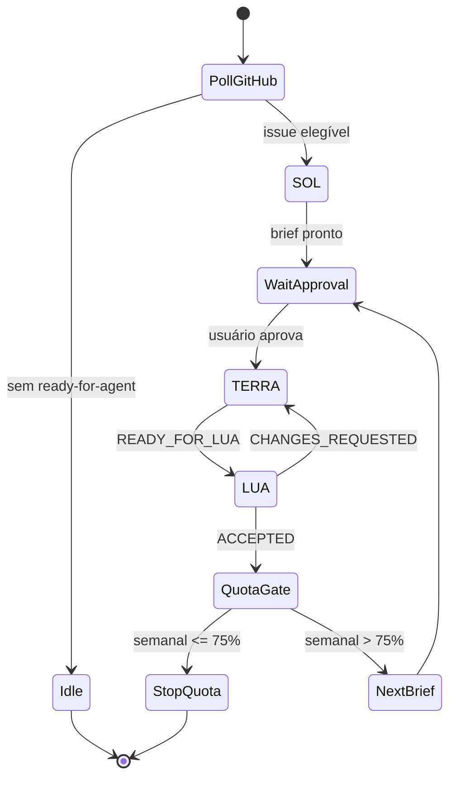

# Continuous development loop (arquivado)

> **ARQUIVADO em 2026-08.** Superseded por `docs/dev-workflow.md`. Este loop era ancorado em GitHub Issues + gate de quota semanal do Codex desktop (`gpt-5.6-*`). O workflow atual é um ciclo recorrente (cron) no Claude Code, com as mesmas roles SOL/TERRA/LUA, sem gate de quota. Mantido aqui apenas por histórico.

# Continuous development loop

## Purpose

Continuously process one ready GitHub issue at a time while the Codex weekly quota is above 75%.

## Trigger

Every 30 minutes, inspect open GitHub Issues labelled `ready-for-agent`. Select oldest issue with no open dependency and no active assignee. If none exists, end this run without messaging the user.

## Quota gate

Source of truth: **Uso restante > Semanal** in Codex desktop.

- At the end of each accepted cycle, ask the user for the current weekly percentage.
- If value is `75%` or lower, stop. Do not create or execute another brief.
- If value is unavailable, stop before selecting another issue. Do not estimate consumption.
- Current confirmed baseline: `95%` on 2026-07-28.

## Roles

### SOL — manager (`gpt-5.6-sol`)

Reads selected issue and relevant repo context. Produces `READY_FOR_EXECUTOR` brief with scope, exclusions, acceptance criteria, risks, test evidence, dependency decision, and UX impact. Does not edit code, test implementation, or review diffs.

### TERRA — executor (`gpt-5.6-terra`)

Implements only approved brief. Uses tests first where applicable. Produces commit, changed-file list, test/lint/build results, dependency list, accessibility evidence, and `READY_FOR_LUA`. Does not change scope or approve work.

### LUA — reviewer (`gpt-5.6-luna`)

Runs correctness review plus `ponytail-review`; runs `ponytail-audit` only when repo-wide simplification is in scope. Uses `impeccable` and `ui-ux-pro-max` for affected UI. Returns only `CHANGES_REQUESTED` or `ACCEPTED`. Does not implement fixes or reprioritize work.

## Cycle



1. Trigger finds one eligible issue.
2. SOL sends `READY_FOR_EXECUTOR`.
3. TERRA implements, verifies, commits, sends `READY_FOR_LUA`.
4. LUA reviews.
5. `CHANGES_REQUESTED`: TERRA fixes only listed findings; repeat steps 3-4.
6. `ACCEPTED`: SOL creates next planning brief with `brainstorming`, `ponytail`, `impeccable`, and `ui-ux-pro-max` insights.
7. Present next brief to user. Wait for explicit approval before TERRA starts next issue.
8. Apply quota gate before any later selection.

## Gates

- No issue label: no work.
- No approved SOL brief: no TERRA work.
- No LUA decision: no completion or successor brief.
- No runtime worker capable of `gpt-5.6-luna`: stop at `READY_FOR_LUA`; never substitute SOL or TERRA.
- No user approval for successor brief: no next execution.
- No current quota value: no next issue.

## Handoffs

```text
READY_FOR_EXECUTOR | issue= | goal= | scope= | out_of_scope= | acceptance= | risks= | dependencies=
READY_FOR_LUA | issue= | commit= | files= | evidence= | ux_a11y= | dependencies= | risks=
CHANGES_REQUESTED | severity= | finding= | location= | expected_fix=
ACCEPTED | issue= | coverage= | residual_risks=
STOP_QUOTA | weekly_remaining= | threshold=75%
```

## Definition of done

An implementer can execute a run without questions: select issue, apply gates, use exact roles and handoffs, then stop at quota or approval gate.
