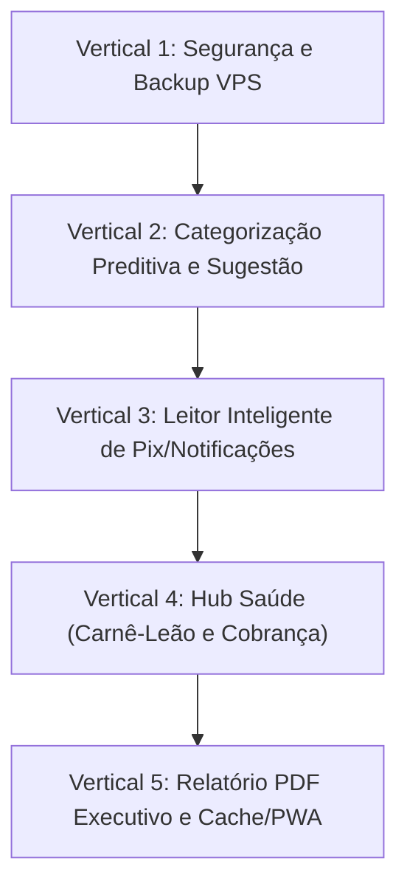

# Plano de Desenvolvimento: Central Financeira Autônoma e Inteligente

Este plano estabelece as entregas verticais para consolidar o **BS Financeiro** como uma plataforma completa de alta produtividade e segurança, dividida em 5 entregas incrementais testáveis.

---

## User Review Required

> [!IMPORTANT]
> **Rotina de Backup da VPS:** O script de backup salvará dumps compactados em `/opt/backups/bsfinanceiro` com retenção automática de 30 dias.
> **Privacidade na Saúde:** Mensagens de cobrança e relatórios fiscais não exportam dados clínicos confidenciais, apenas registros financeiros (nome, data, valor, chave Pix).

---

## Entregas Verticais e Ordem de Execução

---

### Vertical 1: Segurança e Resiliência (Backup Automatizado da VPS)
* **Objetivo:** Garantir integridade e recuperação a desastres do banco PostgreSQL na VPS.
* **Componentes:**
  - Script bash na VPS: `/opt/projects/bsfinanceiro/scripts/backup-db.sh` executando `pg_dump` compactado (`.sql.gz`).
  - Rotação automática apagando backups com mais de 30 dias.
  - Agendamento diário via cron às 03:00 da manhã.
  - Endpoint `GET /api/backup-status` para exibir status do último backup no painel de Configurações.
* **Critérios de Aceite:**
  - Script testado com dump gerado e restaurável.
  - Cron configurado no host `oraclevps2`.

---

### Vertical 2: Categorização Preditiva em Tempo Real
* **Objetivo:** Preenchimento automático instantâneo da categoria ao digitar descrições comuns (ex: iFood, Uber, Farmácia, Posto).
* **Componentes:**
  - Motor em [src/lib/finance/category-predictor.ts](file:///c:/Users/ACPO%20Empreendimentos/Documents/Github/bsfinanceiro/src/lib/finance/category-predictor.ts) combinando dicionário de termos conhecidos com histórico das últimas movimentações do usuário.
  - Integração no `QuickTransactionForm` e nos modais de transação em `TransactionsPage`, `GastosPage` e `DashboardPage`.
* **Critérios de Aceite:**
  - Ao digitar "Uber", o campo Categoria é pré-selecionado para "Transporte".
  - Ao digitar "iFood", a Categoria vira "Alimentação".
  - Se o usuário alterar manualmente, a escolha dele é respeitada.

---

### Vertical 3: Leitor Rápido de Pix e Notificações Bancárias
* **Objetivo:** Registrar despesas e receitas instantaneamente colando o texto de notificações bancárias.
* **Componentes:**
  - Expandir [src/lib/finance/bank-notification-parser.ts](file:///c:/Users/ACPO%20Empreendimentos/Documents/Github/bsfinanceiro/src/lib/finance/bank-notification-parser.ts) com suporte a formatos Pix do Nubank, Santander, Itaú, Bradesco e Inter.
  - Adicionar botão "Colar notificação / Pix" no cabeçalho ou formulário rápido com preenchimento em 1 clique.
* **Critérios de Aceite:**
  - Colar `"Você transferiu R$ 45,00 para Farmácia Raia via Pix"` preenche valor `45,00`, tipo `Despesa`, descrição `"Farmácia Raia"` e categoria `"Saúde"`.

---

### Vertical 4: Módulo Saúde (Carnê-Leão e Gestão de Recebimentos Pendentes)
* **Objetivo:** Resolver a principal dor fiscal e operacional de profissionais da saúde liberais/autônomos.
* **Componentes:**
  - Em [src/app/ganhos/page.tsx](file:///c:/Users/ACPO%20Empreendimentos/Documents/Github/bsfinanceiro/src/app/ganhos/page.tsx):
    - Seção **Pendências de Recebimento**: lista de atendimentos não recebidos com contagem de dias em atraso.
    - Botão **"Copiar lembrete WhatsApp"**: gera mensagem cordial com valor, data e chave Pix para o paciente.
    - Aba/Relatório **Carnê-Leão**: consolidado mensal de receitas de pacientes e despesas operacionais dedutíveis da clínica para cálculo de imposto.
* **Critérios de Aceite:**
  - Lembrete gerado sem informações clínicas sensíveis.
  - Relatório de receitas e despesas dedutíveis exibido com clareza mês a mês.

---

### Vertical 5: Relatório Mensal Executivo em PDF e Cache Zero-Flicker
* **Objetivo:** Gerar relatórios executivos para arquivamento/contabilidade e acelerar a navegação.
* **Componentes:**
  - Em [src/app/relatorios/page.tsx](file:///c:/Users/ACPO%20Empreendimentos/Documents/Github/bsfinanceiro/src/app/relatorios/page.tsx):
    - Botão "Imprimir / Salvar PDF Executivo" com formatação CSS de impressão profissional (`@media print`), logotipo, resumo de receitas, despesas, top categorias e evolução patrimonial.
  - Em [src/app/components/useFinance.ts](file:///c:/Users/ACPO%20Empreendimentos/Documents/Github/bsfinanceiro/src/app/components/useFinance.ts):
    - Cache em memória/SWR dos dados do `/api/bootstrap` para eliminar o "Carregando..." ao alternar entre abas.
* **Critérios de Aceite:**
  - Relatório impresso em PDF limpo em folha A4.
  - Troca entre páginas (Painel -> Ganhos -> Gastos) sem flash de carregamento.

---

## Skills Previstas

| Skill | Etapa de Uso | Evidência Produzida |
|-------|--------------|---------------------|
| `test-driven-development` | Verticais 2, 3 e 4 | Testes unitários para preditor de categoria e parser de notificações bancárias. |
| `verification-before-completion` | Todas as Verticais | Testes rodando 100% verdes (`vitest`), `build` estático concluído, resposta HTTP 200 na VPS. |
| `writing-plans` | Inicial | Plano vertical documentado e aprovado. |

---

## Workflow Autônomo e Gates Mínimos

1. **Preparação:** Verificação de integridade local e na VPS antes de cada vertical.
2. **Execução:** Desenvolvimento progressivo vertical por vertical (código + testes).
3. **Gates Mínimos Obrigatórios:**
   - Lint sem erros (`npm run lint`).
   - Testes unitários 100% verdes (`npx vitest run`).
   - Compilação estática de produção (`npm run build`).
   - Deploy na VPS e verificação de saúde da API (`/api/health`).
4. **Recuperação de Falhas:** Em caso de erro na VPS, rollback do container via Docker Compose com última imagem estável.
5. **Decisões do Agente:** O agente está autorizado a tomar decisões técnicas reversíveis dentro do escopo. Pausas apenas para riscos destrutivos ou decisões de negócio ambíguas.

---

## Verification Plan

### Automated Tests
- `npx vitest run`: garantir que todos os testes existentes (101 arquivos / 428 testes) continuem passando, além dos novos testes criados.
- `npm run build`: validar exportação estática de todas as rotas.

### Manual Verification
- Teste na VPS do backup gerado em `/opt/backups/bsfinanceiro`.
- Teste em browser no site `https://financeiro.bssaude.com.br`: predição de categorias, colagem de Pix, lembrete de cobrança e exportação PDF.
